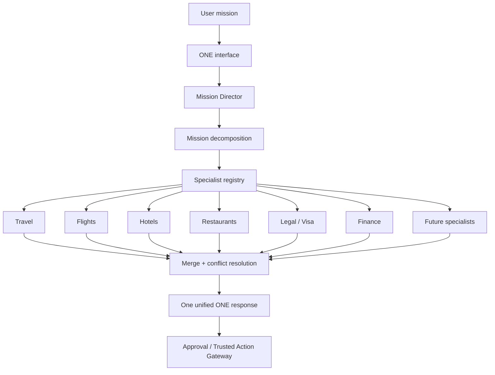

# KASTIZ ONE ALPHA-08 — Multi-Agent Collaboration

ALPHA-08 makes ONE think like an organization while the user still experiences one simple ONE interface.

This milestone does not add multiple chatbots, an agent marketplace, a new conversation UI, or a new AI model. It adds an internal Mission Director and a specialist registry that can be reused by future mission domains.

## Architecture

## Reused systems

- V16 HOS Kernel remains the central orchestration foundation.
- V17 ResolutionPlan remains the solution structure.
- V18 Trusted Action Gateway remains the boundary for provider-safe action requests.
- V19 Mission Completion Loop remains the state and recovery model.
- V23 Experience Layer remains the user-facing travel and experience planner.
- V24 World Intelligence Foundation remains the place/data source layer.
- ALPHA-01 Mission Insights remain contextual insight input.
- ALPHA-02 Progressive Refinement remains the user adjustment layer.
- ALPHA-03 Experience Visualization remains visual itinerary support.
- ALPHA-04 Living Mission remains the mission workspace.
- ALPHA-05 Execution Orchestrator remains execution preparation.
- ALPHA-06 Predictive Intelligence remains proactive suggestion generation.
- ALPHA-07 Personal Mission Memory remains the single shared memory system.

## Specialist registry

Specialists are registered by configuration. Each specialist defines:

- `id`
- `label`
- `domains`
- `triggers`
- `owns`
- `run(input)`

Current specialists:

- Travel
- Flights
- Hotels
- Restaurants
- Logistics
- Visa
- Insurance
- Finance
- Business
- Healthcare
- Legal
- Education
- Career
- Shopping
- Translation

Future specialists can be registered without changing the Mission Director.

## Specialist lifecycle

1. Mission Director receives the current mission result.
2. It decomposes the mission into subproblems.
3. It selects only required specialists.
4. Specialists prepare recommendations only.
5. Each specialist returns:
   - recommendation
   - confidence
   - evidence
   - dependencies
   - expiry
6. The Mission Director merges outputs into one response.
7. Execution still requires approval and the Trusted Action Gateway.

Specialists never execute, book, pay, submit, contact providers, or store private memory.

## Merge algorithm

The Mission Director:

1. Groups specialist outputs by subproblem.
2. Scores each output by confidence plus evidence strength.
3. Keeps the strongest supported recommendation.
4. Removes duplicates by normalized recommendation text.
5. Keeps proactive predictions to a maximum of three.
6. Produces one internal unified response.

## Conflict resolution

Conflicts are resolved internally using:

- confidence
- evidence
- V24 World Intelligence
- ALPHA-07 Personal Mission Memory
- explicit user constraints

The user never sees “Travel Specialist disagreed with Hotel Specialist.” They only see ONE’s final prepared plan.

## Performance strategy

- Only selected specialists run.
- Skipped specialists are recorded for diagnostics.
- Failed specialists degrade gracefully.
- Required specialists produce output independently.
- No external provider calls are made by ALPHA-08.

## Observability

Internal diagnostics record:

- participant IDs
- skipped specialists
- failures
- duration
- average confidence

These diagnostics are not user-facing.

## Safety

ALPHA-08 is preparation-only:

- `specialistsCanExecute=false`
- `executionControlledByApprovalGateway=true`
- `usesUnifiedPersonalMissionMemory=true`
- `privateSpecialistMemory=false`
- `noExternalProviderCalls=true`

